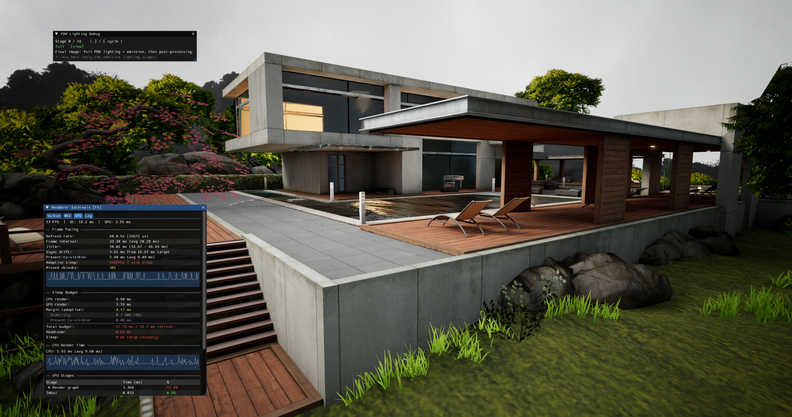
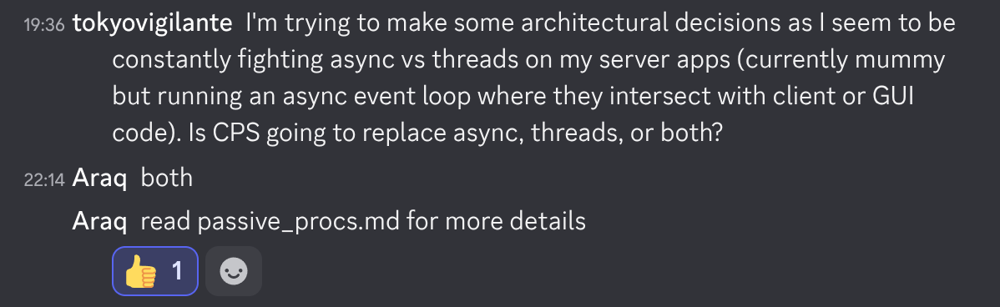

# Nimony v0.6 — Nim, one year in

**2026-09-04**

## Author: "tokyovigilante"

*Nimony 0.6 is out. Rather than a feature list, here is a guest report from a
user who moved a stack of real projects onto the new compiler over the past
year — what pulled them to Nim, where they hit a wall, and what Nimony's
passive procs changed.*

## Finding Nim

I've been writing in [Nim](https://nim-lang.org) for just over a year, after becoming increasingly frustrated with the Swift story on Linux, particularly non-glibc Linux, having in turn becoming increasingly frustrated with the macOS story for power users and swapping my MacBook Pro out for a series of ThinkPads (X230 tablet, then X1 Yoga and now Z13) running first Fedora, then Alpine, and now Debian Linux.

A long search for a memory-safe systems language with a good C FFI and syntax that didn't make my eyes bleed (what even is a borrow checker?) led me to Nim. A language that looks like Python but runs as fast as C? Count me in.

I gave it a little test run with a very basic test harness, essentially a [Wayland](https://wayland.freedesktop.org) OpenGL client that rendered [ImGUI](https://github.com/ocornut/imgui). This worked very well, and was a fairly rapid prototype after finding [Futhark](https://github.com/PMunch/futhark), a neat project using libclang to automatically generate (and regenerate as needed) FFIs for C libraries.

Then, things started getting out of hand...

## Building The World

I am not a programmer by trade, instead a [filthy casual](https://knowyourmeme.com/memes/filthy-casual), but work in an industry plagued by legacy and low-quality enterprise software. I had a desperate need to put together a report templating engine with a zero-footprint web UI, and within a few weeks wrote a frontend SPA in JS, served using [Mummy](https://github.com/guzba/mummy) as a backend, with a minimal Express-like web framework on top. This worked very well, and I deployed it skunkworks fashion to my team in advance of a procurement for an "enterprise" reporting system that did similar things to mine.

However the procurement fell apart, and my system is now widely used internally, and is recognised as being superior to the enterprise version by those that use it. This of course gave me delusions of grandeur, and I picked up a number of other hobby and part-time projects.

The IT world collectively lost its mind over (AI) Christmas 2025, and I got on the bandwagon, it turns out a strongly typed systems language is a perfect fit for coding agents, and progress accelerated rapidly. After a few days of laborious pair programming, I started getting into TDD heavily, speccing out a feature, then a roadmap, writing tests, and having the agent iterate. I took pride in reviewing the output and rewriting portions, but model capabilities continue to accelerate, and it certainly has surpassed my raw programming ability.

In $DAYJOB, I rely on a large number of specialised tools, which I've largely been able to either build on or improve, including:
- Voice recognition / TTS, initially with Whisper via [Vulkan](https://www.vulkan.org)/[whisper.cpp](https://github.com/ggerganov/whisper.cpp) and then using a more specialised Google ASR model;
- Several personal web projects and an online SAT-solver rostering tool for my team, underpinned by a shared web framework;
- A lunatic scale project to replace my primary work tool, a 2D/3D scientific visualisation system, which I'm writing in Vulkan with my own custom compute based renderer, a 2D GPU-accelerated canvas renderer based on [Vello](https://github.com/linebender/vello), and a PBR implementation based on UE4. This has been the most fun...

.. raw:: html

  <figure class="article-figure">
    
    <figcaption>The scientific visualiser, rendering something unscientific...</figcaption>
  </figure>

## The (Concurrency) Wall

It hasn't all been smooth sailing though. I'd been a big fan of Swift's closures and GCD/libdispatch, and tried everything I could to use GCD with Nim, including porting LLVM's blocks to Linux and using libdispatch by FFI. This actually worked very well as a proof of concept and was very performant, but as I was unable to find a way to pin dispatch queues to specific threads (specifically the main queue to thread 0) this proved unworkable for UI code.

I eventually gave up and settled on a combination of OS threads and async/await to manage concurrency and parallelism, which worked well but was never as conceptually appealing to me as just having a bunch of work to do and worker threads to do them. I briefly came across the continuation passing style (CPS) concept as implemented for Nim 2, but the [repo](https://github.com/nim-works/cps) looked relatively abandoned, and I couldn't get my head round the concept of just folding up your whole stack and putting it to one side for a rainy day.

However managing interactions between OS threads, locks, and async/await became too painful in an embedded server project I was working on. At an impasse, and knowing a new language/compiler version was in the works, I asked THE BOSS.

.. raw:: html

  <figure class="article-figure">
    
    <figcaption>Straight to the point.</figcaption>
  </figure>

## Breaking Through

It turns out the new [Nimony](https://github.com/nim-lang/nimony) compiler (which will eventually become Nim 3) does CPS by marking functions with `{.passive.}` (see [passive_procs.md](https://github.com/nim-lang/nimony/blob/master/doc/passive_procs.md)) which means they can be suspended along with their stack, and resumed/replayed when whatever IO or compute task they are running completes. This gives you all the benefits of async/await without [coloured functions](https://journal.stuffwithstuff.com/2015/02/01/what-color-is-your-function/). Instead, functions can be suspended and farmed out to a worker thread pool, or more ambitiously, your whole event thread can run on an `epoll`-based wait, and events just fire off as continuations resume.

This has been astonishingly successful, and I was able to rebuild my web framework on top of a custom CPS-based web server that quickly hit performance parity with Mummy ([Hashi](https://git.sr.ht/~tokyovigilante/hashi) 橋 - "bridge"). Like all my projects, it has delusions of grandeur and wants to grow from its current HTTP 1.1 and WebSocket support to an HTTP/3 and WebTransport server, but baby steps... Hashi now underpins all my web apps, and drunk on success, I've spent the last month or so porting all of my Nim 2 projects over to Nimony. The core developers including [Araq](https://github.com/Araq) have been incredibly helpful and supportive, either fixing or merging numerous Nimony bugfixes found along the way.

Although Nimony is still early in development, with CPS in particular my code is already more robust and performant than it was using Nim 2. The compiler is also seeing rapid improvements, particularly towards `lib/std` parity with Nim 2, and it's great to be a part of bringing that closer.

----

## Getting Nimony 0.6

Prebuilt toolchains for Linux x86_64, Linux ARM64, macOS ARM64 and Windows
x86_64 are published as [nightly releases](https://github.com/nim-lang/nimony-website/releases);
each archive pins the exact compiler revision it was built from. To build the
compiler yourself instead, follow the [installation instructions](install.html).

Bug reports, questions and PRs are all welcome at
[nim-lang/nimony](https://github.com/nim-lang/nimony). If you want this
direction to continue but your time is scarce, contributions are welcome via
our [Open Collective](https://opencollective.com/nim).
